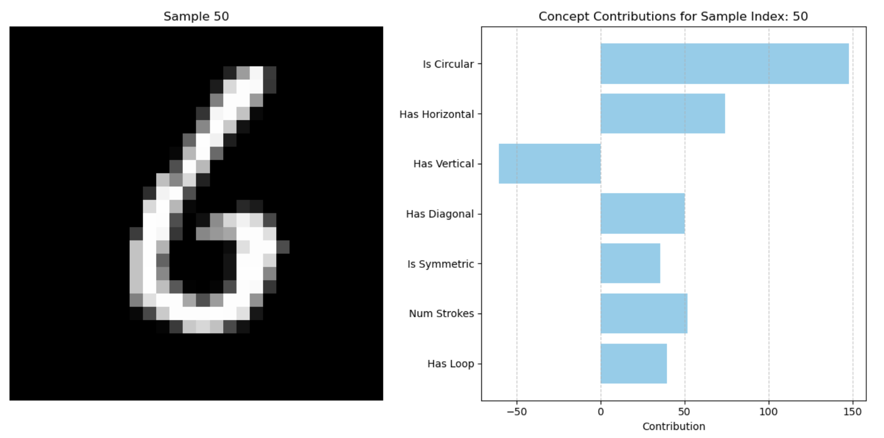

# ConceptBottleneck-GUI-Experiment

## Purpose
This project explores Concept Bottleneck Models (CBMs) through a simple CNN architecture using the MNIST dataset. The goal is to deeply understand CBMs, which will help in developing a GUI interface that builds on Lily’s paper, automating the integration of CBMs into large language models (LLMs).

## Project Structure
- `data/`: Placeholder for raw data files.
- `src/`: Contains the main source code.
  - `model.py`: Defines the `ConceptBottleneckCNN` class.
  - `train.py`: Implements the training loop with concept and classification losses.
  - `test.py`: Implements the testing loop with evaluation metrics.
  - `utils.py`: Contains helper functions for data loading and concept label generation.
  - `visualization.py`: Functions to plot concept activations and contributions.
  - `hooks.py`: Hook functions to capture concept activations and contributions.
- `config/`: Contains configuration files.
  - `config.json`: Stores hyperparameters and other settings.
- `scripts/`: Contains scripts for running the training and testing processes.
  - `run.py`: Main script to execute the pipeline.
- `outputs/`: Stores activations, contributions, and generated visualizations.
- `requirements.txt`: Lists dependencies for the project.
- `.gitignore`: Specifies files and directories to be ignored by Git.

## How to Run the Project

### 1. Set Up the Environment
#### Create and activate a virtual environment:
```bash
python -m venv cbm_env  # Create virtual environment
source cbm_env/bin/activate  # Activate it on macOS/Linux
cbm_env\Scripts\activate  # Activate it on Windows
```

#### Install the required dependencies:
```bash
pip install -r requirements.txt
```


### 2. Data Preparation
The dataset will automatically be downloaded and saved in the correct structure under `data/MNIST/raw/` when you run the script. If the files already exist, they will be used directly.

### 3. Run the Training and Testing Script
Navigate to the project directory and run the training script:

```bash
cd ConceptBottleneck-GUI-Experiment  # Navigate to the project directory
python scripts/run.py  # Train and test the model
```

#### Visualizing the Results
Our goal is to visualize the concept activations and concept contributions. I manually created 7 concept labels for this Concept Bottleneck layer. The contibution outputs is shown here:



### Project Goal
Now that we have a basic foundation of CBL. Our project addresses to develop a user-friendly GUI that automates much of the technical complexity involved in integrating and interacting with CBLs in LLMs. Weng et al. (2024) developed an automated pipeline to integrate CBLs into LLMs, but it  requires users to run technical scripts. The GUI is designed with five main interfaces that guide the user through the process of integrating a CBL into an LLM, from dataset selection to model experimentation and history tracking.


The proposed GUI will use React for the frontend and Python for the backend. React will handle the dynamic UI, while Python will run ML tasks using PyTorch. When a user clicks a button, React will send a request to the Python backend, triggering a script. The backend will process the request, and React will update the UI with the results.


