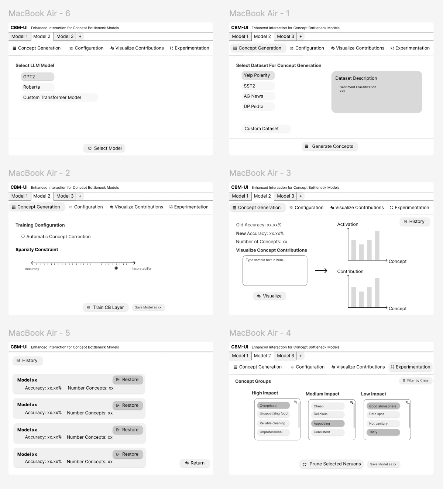

# ConceptBottleneck-GUI-Experiment

This project builds on Weng et al. (2024) [Crafting Large Language Models for Enhanced Interpretability](https://arxiv.org/abs/2407.04307) by developing a user-friendly GUI for integrating Concept Bottleneck Layers (CBLs) into Large Language Models (LLMs). Weng's Concept Bottleneck Large Language Model (CB-LLM) combines high accuracy, scalability, and interpretability, setting a new standard for transparent AI.

Our GUI simplifies the process, enabling users of all skills levels to visualize concept activations, adjust weights, and unlearn biases, promoting interpretability, fairness, and trustworthiness.


## Project Structure
## Project Structure

- `src/`: Core source code for the project, including:  
  - `app.js`: Core React frontend code responsible for handling user interactions and making API calls to the backend.  
  - `index.js`: Entry point for executing `app.js` in the React frontend.  
  - `app.py`: Backend Flask application handling API calls from the React frontend to execute scripts.  
  - `get_concept_labels.py`: Extracts concepts from the selected dataset. Currently defaults to SetFit SST2 for the MVP.  
  - `train_CBL.py`: Handles the training of the Concept Bottleneck Layer (CBL) and Automatic Concept Scoring (ACS).  
  - `train_FL.py`: Trains the full LLM model by appending the CBL layer. Currently defaults to RoBERTa, a fine-tuned version of Google's BERT model.  
  - `mpnet_acs/`: Directory storing the trained model weights after CBL training, ACS, and fine-tuning.  
  - `utils.py`: Helper functions for data processing and concept generation.  
- `config/`: Configuration files for the project.  
  - `config.json`: Contains hyperparameters, dataset details, and training settings.  
- `public/`: Static assets for the GUI frontend, managed by React.  
- `outputs/`: Stores results, including concept activations, visualizations, and logs from training and testing sessions.  
- `package.json`: Defines Node.js dependencies for the React frontend.  
- `requirements.txt`: Lists Python dependencies for backend machine learning tasks.  


## How to Run the Project

### 1. Set Up the Environment
#### Create and activate a virtual environment:
```bash
python -m venv cbm_env  # Create virtual environment
source cbm_env/bin/activate  # Activate it on macOS/Linux
cbm_env\Scripts\activate  # Activate it on Windows
```

#### Install the required dependencies:
```bash
pip install -r requirements.txt
```

### 2. Frontend Setup
#### Install Node.js dependencies:
```bash
npm install

```

### 3. Running the Project
#### Start the Frontend. From the root folder, run:
```bash
npm start
```
This will start the React frontend server.

#### Start the Backend
Navigate to the src folder:
```bash
cd src
```
#### Run the Flask backend server:
```bash
python app.py
```


### Project Goal
Now that we have a basic foundation of CBL. Our project addresses to develop a user-friendly GUI that automates much of the technical complexity involved in integrating and interacting with CBLs in LLMs. Weng et al. (2024) developed an automated pipeline to integrate CBLs into LLMs, but it  requires users to run technical scripts. The GUI is designed with five main interfaces that guide the user through the process of integrating a CBL into an LLM, from dataset selection to model experimentation and history tracking.




### Minimal Viable Product
The user interface depicted above represents our ultimate vision and serves as the primary inspiration for this project. Our aim is to create an intuitive and accessible platform that enables users to seamlessly integrate Concept Bottleneck Layers (CBLs) into Large Language Models (LLMs). This interface embodies the goal of fostering transparency, fairness, and trust in AI systems.

Currently, we are focused on developing a minimal viable product (MVP) that captures the core functionality of this vision. The MVP will provide essential features such as model configuration, concept visualization, and bias mitigation. 


### Home Page MVP 
The home page of the CBM-GUI Minimum Viable Product (MVP) allows users to select hardware, train the Concept Bottleneck Layer (CBL), and classify inputs.


Users can choose to train the CBL layer on either local hardware or the DSMPL UCSD server. ***Currently the backend defaults to local hardward.*** Once the hardware is selected, users can click "Train" to start the training process. Training duration varies based on the hardware, typically taking between 5 to 45 minutes.

For the MVP, the model is pre-selected as a fine-tuned RoBERTa model from Google, and the CBL layer is trained on the SetFit SST2 dataset, which includes 6,920 movie review samples labeled as positive or negative. After training, users can input text for classification and view the top concept contributions that influenced the model's decision-making process.


The figure above demonstrates the CBM-GUI's ability to classify text and highlight the top concept contributions influencing the model's decision-making process. For the input "The plot was written by a 5-year-old," the model identifies key concepts such as "Disjointed narrative structure," "Lack of thematic depth," "Incoherent storytelling," and "Weak or poorly developed plot" as the primary drivers behind the classification. These contributions are visually represented in a bar chart, where the activation levels of each concept indicate their relative importance. This functionality provides users with a clear and interpretable view of how the model reaches its conclusions.

For more information, [refer to our paper here](Paper_Q1.pdf).


